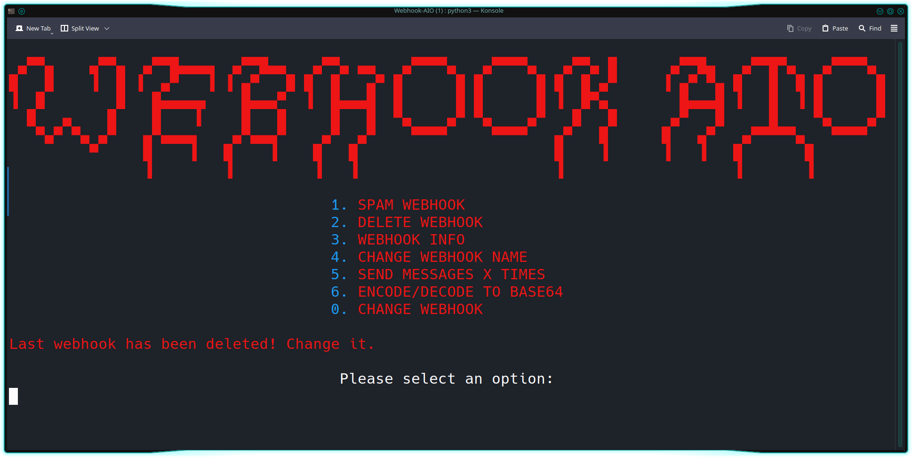

# Webhook-AIO
I only use this to destroy ratters webhooks, but if you need this or take inspo, go ahead. ❗ It won't be updated. ❗
## Preview

## Setup
0. Download the rep ```git clone https://github.com/Keczuu/Webhook-AIO.git && cd Webhook-AIO```
1. Add your proxies in `data/proxies.txt`
2. Start `FIRST OPENING.bat`
3. Start `OPEN AIO.bat`
4. Put your webhooks in
5. You are good to go
## License
This project is licensed under the GPL General Public License v3.0 License
```js
  ・Educational purpose only and all your consequences caused by you actions is your responsibility
  ・Selling this AIO is forbidden
  ・If you make a copy of this/or fork it, it must be open-source and have credits linking to this repo
```
## WARNING
This github repository is only for EDUCATIONAL PURPOSES ONLY. I am NOT under any responsibility if anything happens to you.
## Contact
- Discord - keczuu
